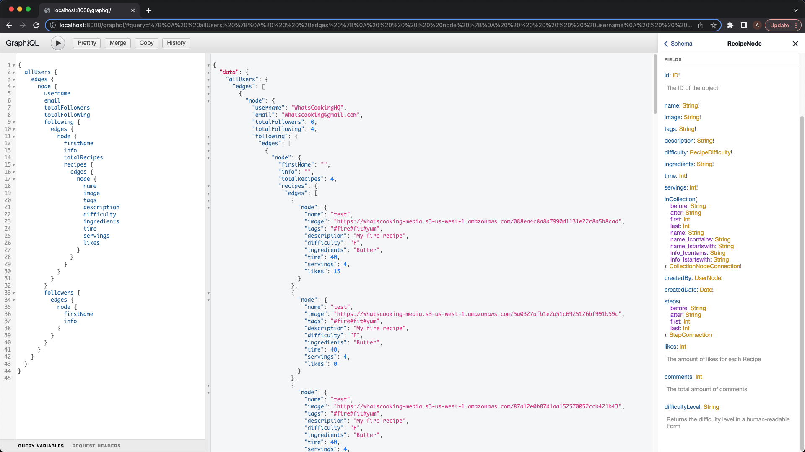

# WhatsCooking

This repository is for the backend portion of WhatsCooking. It is a social media platform for discovering and sharing recipes that is built on GraphQL. The frontend portion can be found [here](https://github.com/A-T-Juin/Whatscooking-Frontend)

## Motivation

This project was conceived by my love for cooking and urge to learn more about GraphQL. I constantly search for new things to whip up in the kitchen, but often times, I struggle with *what* to cook. To solve this, I would first go to a website that has plenty of food images (to spark an interest) *then* I would need to go to a separate site to find a recipe for that dish. This is the process that I wanted to simplify with WhatsCooking -- an application that can both showcase many different images of food in an aesthetic way, while providing clear directions on how to create it.

## Built With

 - Django
 - Graphene
 - GraphQL
 - AWS
 - Python

## GraphQL Sample Query

## Contribute

If you're interested in helping with the project, email me @ AllanJuin@AllanJuin.me !
